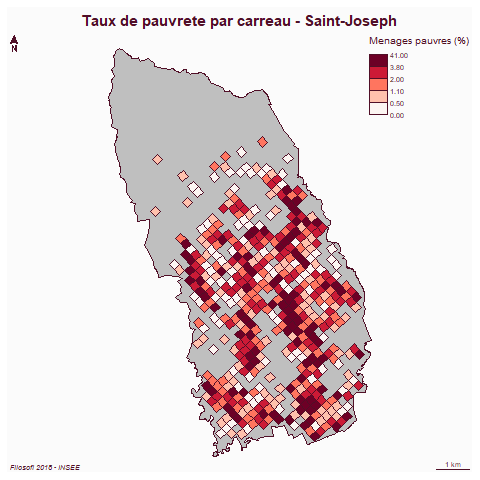
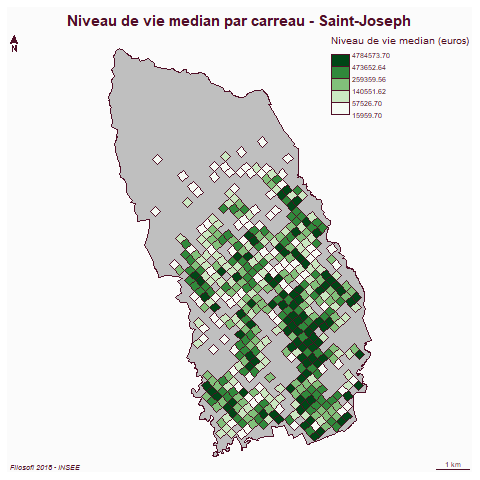
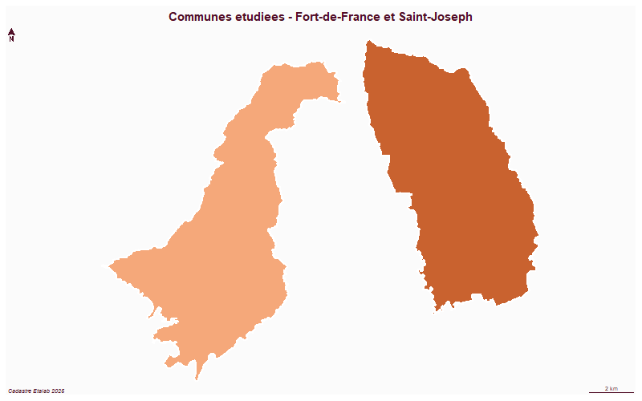
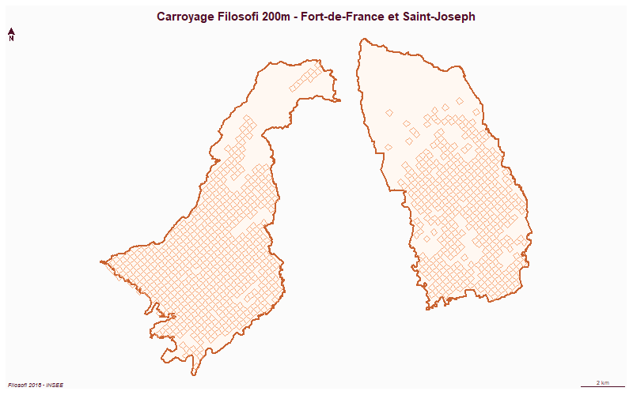

```{r setup, include=FALSE}
knitr::opts_chunk$set(echo = FALSE, message = FALSE, warning = FALSE)
library(sf)
library(mapsf)

fort_de_france <- st_read("C:/Users/PC-Etudiant/Downloads/base.gpkg", "commune", quiet = TRUE)
fort_de_france <- fort_de_france[fort_de_france$id == "97209",]
fort_de_france <- st_transform(fort_de_france, 2154)

saint_joseph <- st_read("C:/Users/PC-Etudiant/Downloads/base.gpkg", "commune_sj", quiet = TRUE)
saint_joseph <- st_transform(saint_joseph, 2154)

car <- st_read("C:/Users/PC-Etudiant/Downloads/base.gpkg", "car", quiet = TRUE)
car <- st_transform(car, 2154)
car_fdf <- car[car$lcog_geo == "97209",]
car_sj <- car[car$lcog_geo == "97212",]

communes_ensemble <- st_union (st_geometry(fort_de_france), st_geometry(saint_joseph))
```

# {.tabset}

## Accueil

### Est-ce que les revenus, la pauvreté ou le niveau de vie dans les communes de Fort-de-France et de Saint-Joseph (Martinique) influencent-ils le vote des électeurs ?

#### On essayera de voir s'il existe des corrélations entre revenus et abstention, le niveau de revenus moyens... et cela en fonction de la commune et de son taux d'abstention

##### C'est une étude sur le vote et les CSP qui votent ou non. Quelles sont les personnes qui s'abstiennent le plus, le moins ?

Les deux communes étudiées, Fort-de-France et Saint-Joseph, présentent des profils socio-économiques contrastés. Fort-de-France est la préfecture de Martinique, commune urbaine dense d'environ 80 000 habitants, tandis que Saint-Joseph est une commune péri-urbaine plus résidentielle d'environ 16 000 habitants. Cette différence de profil urbain se traduit par des inégalités de revenus et de niveau de vie que les données carroyées Filosofi permettent de spatialiser finement. L'enjeu de ce projet est de croiser ces données socio-économiques avec les comportements électoraux, en partant de l'hypothèse que les zones de plus grande pauvreté tendent à présenter des taux d'abstention plus élevés.

#### Fort-de-France

##### Taux de pauvreté

```{r, results='hide'}
png("C:/Users/PC-Etudiant/Downloads/carte_pauvrete_fdf.png")
mf_map(fort_de_france)
mf_map(car_fdf, type = "choro", var = "men_pauv",
       breaks = "quantile", nbreaks = 5,
       pal = "Reds",
       leg_title = "Menages pauvres (%)",
       add = TRUE)
mf_layout("Taux de pauvrete par carreau - Fort-de-France",
          "Filosofi 2018 - INSEE")
dev.off()
```


La carte du taux de pauvreté à Fort-de-France révèle une concentration marquée des ménages pauvres dans certains quartiers, notamment dans les zones périphériques et les secteurs d'habitat social. Cette distribution spatiale n'est pas homogène : certains carreaux affichent des taux de pauvreté très élevés, contrastant fortement avec des secteurs plus aisés du centre-ville ou des hauteurs de la commune. Cette géographie de la pauvreté est un premier indicateur spatial pertinent pour notre problématique : les travaux en sociologie électorale montrent que les quartiers les plus défavorisés tendent à présenter des taux d'abstention plus importants, les habitants se sentant moins représentés par les institutions politiques.

##### Niveau de vie médian

```{r, results='hide'}
png("C:/Users/PC-Etudiant/Downloads/carte_revenu_fdf.png")
mf_map(fort_de_france)
mf_map(car_fdf, type = "choro", var = "ind_snv",
       breaks = "quantile", nbreaks = 5,
       pal = "Greens",
       leg_title = "Niveau de vie median (euros)",
       add = TRUE)
mf_layout("Niveau de vie median par carreau - Fort-de-France",
          "Filosofi 2018 - INSEE")
dev.off()
```


La carte du niveau de vie médian confirme et précise la lecture de la carte de pauvreté. On observe une structuration spatiale des revenus à Fort-de-France qui suit globalement un gradient centre-périphérie, avec des niveaux de vie plus élevés dans certains secteurs résidentiels et des niveaux très faibles dans d'autres zones. Cette polarisation économique intra-communale est caractéristique des grandes communes urbaines des Antilles françaises, où les héritages historiques et fonciers ont fortement structuré la répartition spatiale des richesses.

#### Saint-Joseph

##### Taux de pauvreté

```{r, results='hide'}
png("C:/Users/PC-Etudiant/Downloads/carte_pauvrete_sj.png")
mf_map(saint_joseph)
mf_map(car_sj, type = "choro", var = "men_pauv",
       breaks = "quantile", nbreaks = 5,
       pal = "Reds",
       leg_title = "Menages pauvres (%)",
       add = TRUE)
mf_layout("Taux de pauvrete par carreau - Saint-Joseph",
          "Filosofi 2018 - INSEE")
dev.off()
```



À Saint-Joseph, la distribution spatiale de la pauvreté diffère sensiblement de celle observée à Fort-de-France. La commune présente un tissu urbain moins dense et une organisation spatiale plus diffuse, ce qui se traduit par une répartition des carreaux pauvres plus dispersée sur le territoire. Comparativement à Fort-de-France, le profil de pauvreté y est globalement différent, ce qui pourrait expliquer des comportements électoraux distincts entre les deux communes.

##### Niveau de vie médian

```{r, results='hide'}
png("C:/Users/PC-Etudiant/Downloads/carte_revenu_sj.png")
mf_map(saint_joseph)
mf_map(car_sj, type = "choro", var = "ind_snv",
       breaks = "quantile", nbreaks = 5,
       pal = "Greens",
       leg_title = "Niveau de vie median (euros)",
       add = TRUE)
mf_layout("Niveau de vie median par carreau - Saint-Joseph",
          "Filosofi 2018 - INSEE")
dev.off()
```



Le niveau de vie médian à Saint-Joseph confirme le profil plus résidentiel et relativement plus aisé de cette commune par rapport à Fort-de-France. La carte montre une distribution des revenus plus homogène, avec moins d'écarts extrêmes entre carreaux. Cette relative homogénéité économique contraste avec la forte polarisation observée à Fort-de-France.

#### Conclusion

Cette étude cartographique des données Filosofi 2018 sur Fort-de-France et Saint-Joseph apporte plusieurs éléments de réponse à notre problématique. Les deux communes présentent des profils socio-économiques contrastés : Fort-de-France, commune urbaine dense, est marquée par de fortes inégalités spatiales de revenus et des taux de pauvreté élevés dans certains quartiers, tandis que Saint-Joseph présente un profil plus homogène et globalement moins défavorisé.

Ces constats rejoignent les grandes conclusions de la littérature en géographie électorale : les inégalités économiques spatiales ont tendance à produire des comportements électoraux différenciés. Dans les zones de forte pauvreté, l'abstention est généralement plus élevée, traduisant un sentiment de décrochage vis-à-vis des institutions politiques.

Pour aller plus loin, il serait nécessaire de croiser ces données avec les résultats électoraux bureau de vote par bureau de vote, afin de vérifier empiriquement ces hypothèses.

## Données

### Les données utilisées

Ce projet mobilise trois sources de données géographiques principales, toutes intégrées dans le fichier `base.gpkg`.

---

#### Limites communales — Cadastre Etalab

**Source :** [cadastre.data.gouv.fr](https://cadastre.data.gouv.fr/data/etalab-cadastre/2025-12-01/shp/departements/972/)

**Format :** Shapefile (.shp) converti en GeoPackage

**Projection :** Lambert 93 (EPSG:2154)

**Couches :** `commune` (Fort-de-France) et `commune_sj` (Saint-Joseph)

```{r, results='hide'}
png("C:/Users/PC-Etudiant/Downloads/carte_communes.png", width = 800, height = 500)
mf_init (communes_ensemble)
mf_map(fort_de_france, col = "#f5a87a", border = "white", lwd = 2, add = TRUE)
mf_map(saint_joseph, col = "#c9622f", border = "white", lwd = 2, add = TRUE)
mf_layout("Communes etudiees - Fort-de-France et Saint-Joseph",
          "Cadastre Etalab 2025")
dev.off()
```



---

#### Carreaux Filosofi 200m — INSEE

**Source :** [insee.fr](https://www.insee.fr/fr/statistiques/7655475?sommaire=7655515)

**Format :** GeoPackage (.gpkg)

**Projection :** Lambert 93 (EPSG:2154)

**Couche :** `car` — carreaux de 200m couvrant Fort-de-France et Saint-Joseph

**Variables clés :**

- `men_pauv` : part des ménages pauvres (%)
- `ind_snv` : niveau de vie médian (€)
- `lcog_geo` : code commune de rattachement

```{r, results='hide'}
png("C:/Users/PC-Etudiant/Downloads/carte_carreaux.png", width = 800, height = 500)
mf_map(communes_ensemble, col = NA, border = NA)
mf_map(fort_de_france, col = "#fff8f2", border = "#c9622f", lwd = 2, add = TRUE)
mf_map(saint_joseph, col = "#fff8f2", border = "#c9622f", lwd = 2, add = TRUE)
mf_map(car_fdf, col = NA, border = "#f5a87a", add = TRUE)
mf_map(car_sj, col = NA, border = "#f5a87a", add = TRUE)
mf_layout("Carroyage Filosofi 200m - Fort-de-France et Saint-Joseph",
          "Filosofi 2018 - INSEE")
dev.off()
```



---

## MNT

### Modèles Numériques de Terrain et de Surface — Fort-de-France et Saint-Joseph

L'analyse MNT/MNS constitue un complément essentiel à notre problématique. En croisant le Modèle Numérique de Terrain (surface nue, sans végétation ni bâti) et le Modèle Numérique de Surface (incluant tous les objets au sol), il est possible de calculer un Modèle Numérique de Hauteur (MNH = MNS - MNT), qui permet de visualiser la hauteur du bâti et de la végétation carreau par carreau.

Dans le cadre de notre étude sur les inégalités à Fort-de-France et Saint-Joseph, ce croisement aurait permis d'analyser la qualité de la voirie dans des rues de quartiers aux profils socio-économiques contrastés — notamment la Rue Victor Sévère (quartier aisé), la Rue Case Nègre (quartier populaire de Trénelle) et la Rue Lazare Carnot (quartier intermédiaire) à Fort-de-France. L'hypothèse sous-jacente est que l'état de la voirie, révélé par les irrégularités de pente dans le MNT LiDAR, pourrait refléter les inégalités d'entretien des infrastructures selon le niveau socio-économique des quartiers — et ainsi constituer un indicateur supplémentaire des disparités spatiales que nous cherchons à relier aux comportements électoraux.

**Cette analyse n'a cependant pas pu être réalisée.** La campagne LiDAR HD de l'IGN, qui produit les données MNT et MNS à haute résolution (0,5m), ne couvre à ce jour que la France métropolitaine. La Martinique, comme l'ensemble des territoires d'outre-mer, n'est pas incluse dans le programme de diffusion actuel, comme l'illustre la carte ci-dessous.


*Source : IGN — Prévision de disponibilité des nuages de points et modèles numériques Lidar HD au 05/03/2026*

Les sites consultés sans succès pour obtenir ces données sont les suivants :

- **cartes.gouv.fr** — Téléchargement IGNF MNT-LIDAR-HD : [https://cartes.gouv.fr/telechargement/IGNF_MNT-LIDAR-HD](https://cartes.gouv.fr/telechargement/IGNF_MNT-LIDAR-HD)
- **cartes.gouv.fr** — Téléchargement IGNF MNS-LIDAR-HD : [https://cartes.gouv.fr/telechargement/IGNF_MNS-LIDAR-HD](https://cartes.gouv.fr/telechargement/IGNF_MNS-LIDAR-HD)
- **Géoservices IGN** — BD ALTI (MNT 25m) : [https://geoservices.ign.fr/bdalti](https://geoservices.ign.fr/bdalti)
- **Copernicus DEM** — Modèle numérique mondial 30m : [https://copernicus-dem-30m.s3.amazonaws.com](https://copernicus-dem-30m.s3.amazonaws.com)
- **DEAL Martinique** — Direction de l'Environnement, de l'Aménagement et du Logement : [https://www.martinique.developpement-durable.gouv.fr](https://www.martinique.developpement-durable.gouv.fr)